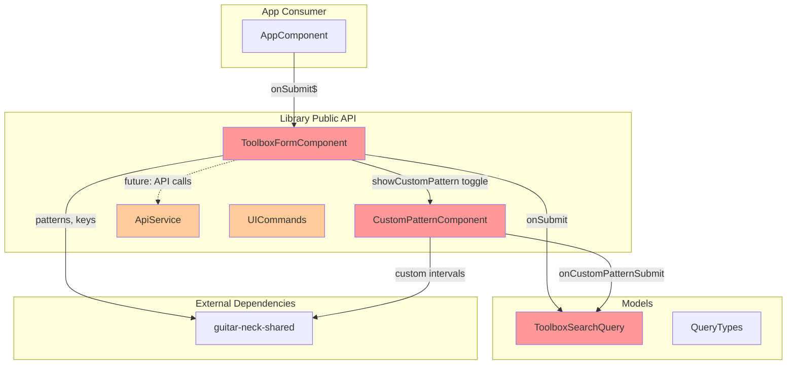

# Przegląd kodu biblioteki `guitar-toolbox-lib`

## 1. BŁĘDY KRYTYCZNE (Critical — wymagają natychmiastowej naprawy)

### 1.1 Testy `UICommands.spec.ts` odnoszą się do nieistniejących serwisów i importów ❌

Plik [`projects/guitar-toolbox-lib/src/lib/shared/UICommands.spec.ts`](projects/guitar-toolbox-lib/src/lib/shared/UICommands.spec.ts) importuje ścieżki, które nie istnieją w bibliotece:

- `'../services/guitar-neck.service'` — nie istnieje
- `'../services/note.service'` — nie istnieje
- `'../services/note-selection.service'` — nie istnieje
- `'./model/guitarNote'` — nie istnieje
- `'./model/scaleTypes'` — nie istnieje

Dodatkowo test tworzy komendy z **3 argumentami**:
```typescript
new DisplaySingleNoteCommand(noteService, guitarNeckService, 'A');
```
... podczas gdy rzeczywista implementacja w [`UICommands.ts`](projects/guitar-toolbox-lib/src/lib/shared/UICommands.ts:17-25) przyjmuje tylko **2 argumenty**:
```typescript
constructor(
    private noteSelector: NoteSelector,
    private keys: string) {}
```

**Skutek:** Testy nie skompilują się i nie przejdą. **Cały plik testowy jest niespójny z implementacją.**

### 1.2 Naruszenie typu `ToolboxSearchQuery` — `musicElements` jako `number[]` ❌

Interfejs [`ToolboxSearchQuery`](projects/guitar-toolbox-lib/src/lib/shared/model/musicElements.ts:1-5) definiuje:
```typescript
export interface ToolboxSearchQuery {
  musicElements: string;
  keys: string;
  type: QueryTypes;
}
```

Ale w [`CustomPatternComponent.onSubmit()`](projects/guitar-toolbox-lib/src/lib/custom-pattern/custom-pattern.component.ts:33-37) `musicElements` jest przypisywane jako `number[]` (tablica interwałów):
```typescript
const query: ToolboxSearchQuery = {
    type: 'custom',
    musicElements: intervals,  // intervals: number[]
    keys: formValue.rootNote
};
```

**Skutek:** Błąd typu TypeScript. Należy rozszerzyć interfejs o `musicElements: string | number[]` lub wprowadzić osobny typ.

### 1.3 Selector `app-custom-pattern` w komponencie biblioteki ❌

[`CustomPatternComponent`](projects/guitar-toolbox-lib/src/lib/custom-pattern/custom-pattern.component.ts:8) używa selektora `app-custom-pattern`, który sugeruje przynależność do aplikacji, a nie biblioteki. Standard Angular dla bibliotek nakazuje używanie dedykowanego prefiksu (np. `lib-custom-pattern`).

**Skutek:** Potencjalny konflikt selektorów, jeśli aplikacja konsumująca też zdefiniuje komponent z selektorem `app-custom-pattern`.

### 1.4 Brak `HttpClientTestingModule` w teście `ApiService` ❌

[`api.service.spec.ts`](projects/guitar-toolbox-lib/src/lib/api.service.spec.ts:9) nie dostarcza `HttpClientTestingModule` ani `provideHttpClient(withInterceptorsFromDi())`, co oznacza, że `HttpClient` nie zostanie wstrzyknięty — test nie przejdzie.

### 1.5 Memory leak — subskrypcja `valueChanges` nigdy nie jest anulowana ❌

W [`ToolboxFormComponent`](projects/guitar-toolbox-lib/src/lib/toolbox-form/toolbox-form.component.ts:45-49) konstruktor subskrybuje `valueChanges`, ale nie przechowuje referencji do `Subscription` ani nie implementuje `OnDestroy`.

```typescript
this.guitarForm.get('elementType')?.valueChanges.subscribe(type => { ... });
```

**Skutek:** Wyciek pamięci przy wielokrotnym tworzeniu/niszczeniu komponentu.

---

## 2. USTERKI I PROBLEMY (Major — zalecane do naprawy)

### 2.1 Hardkodowany URL API 🔶

[`ApiService`](projects/guitar-toolbox-lib/src/lib/api.service.ts:9) ma na sztywno `http://localhost:3000/api`. Brak możliwości konfiguracji przez `InjectionToken` lub `APP_INITIALIZER`. To już jest udokumentowane w `AGENTS.md` jako znane ryzyko.

### 2.2 Brak eksportów w `public-api.ts` 🔶

[`public-api.ts`](projects/guitar-toolbox-lib/src/public-api.ts) eksportuje tylko `ToolboxFormComponent`. Brakuje eksportów dla:
- `ApiService`
- `UICommands` (wszystkie klasy Command i interfejs NoteSelector)
- `ToolboxSearchQuery`, `QueryTypes`
- `CustomPatternComponent`
- `GuitarNeck`

### 2.3 Niespójność nazewnictwa `onSubmit$` 🔶

W [`ToolboxFormComponent`](projects/guitar-toolbox-lib/src/lib/toolbox-form/toolbox-form.component.ts:16) `@Output()` nazywa się `onSubmit$`. Konwencja `$` w Angular/RxJS oznacza Observable, ale `EventEmitter` nie jest Observable w kontekście szablonów. Należy zmienić na `onSubmit` (bez `$`), aby zachować spójność z konwencją Angular.

### 2.4 `GuitarNeck` — nieużywana klasa 🔶

Klasa [`GuitarNeck`](projects/guitar-toolbox-lib/src/lib/shared/GuitarNeck.ts) jest zdefiniowana z `export default`, ale nie jest używana w żadnym komponencie ani serwisie w bibliotece. Nie jest też eksportowana w `public-api.ts`.

---

## 3. OPTYMALIZACJE (Optimization — poprawa jakości kodu)

### 3.1 Duplikacja stylów CSS 🟡

[`toolbox-form.component.scss`](projects/guitar-toolbox-lib/src/lib/toolbox-form/toolbox-form.component.scss) i [`custom-pattern.component.scss`](projects/guitar-toolbox-lib/src/lib/custom-pattern/custom-pattern.component.scss) zawierają prawie identyczne definicje dla `.form-row`, `.form-select`, `button`. Można utworzyć współdzielony plik SCSS.

### 3.2 Użycie `any` zamiast konkretnych typów 🟡

W kilku miejscach użyto `any`:
- [`NoteSelector`](projects/guitar-toolbox-lib/src/lib/shared/UICommands.ts:6-10) — metody zwracają `any`
- [`AppComponent.toolboxSubmit(query: any)`](projects/guitar-toolbox-lib/src/app/app.component.ts:14)
- [`UICommands.ts:44-46,61-63`](projects/guitar-toolbox-lib/src/lib/shared/UICommands.ts) — callbacki subscribe z `any`

### 3.3 Inline style w szablonie 🟡

W [`toolbox-form.component.html:42`](projects/guitar-toolbox-lib/src/lib/toolbox-form/toolbox-form.component.html:42) użyto `[style.backgroundColor]="'#004400'"` zamiast klasy CSS. Lepiej przenieść do pliku SCSS.

### 3.4 Brak informacji zwrotnej dla użytkownika 🟡

Ani [`ToolboxFormComponent.onSubmit()`](projects/guitar-toolbox-lib/src/lib/toolbox-form/toolbox-form.component.ts:52-61), ani [`CustomPatternComponent.onSubmit()`](projects/guitar-toolbox-lib/src/lib/custom-pattern/custom-pattern.component.ts:27-40) nie informują użytkownika, gdy formularz jest nieprawidłowy (np. przez komunikat walidacji).

### 3.5 Responsywność layoutu 🟡

Oba formularze używają `padding: 0 25%`, co może powodować problemy na małych ekranach. Warto zastosować `max-width` z `margin: auto` zamiast procentowego paddingu.

---

## 4. PODSUMOWANIE — priorytety napraw

| Priorytet | Obszar | Szacowany wysiłek |
|-----------|--------|-------------------|
| 🔴 P1 | Naprawa testów `UICommands.spec.ts` | Średni |
| 🔴 P2 | Naprawa typu `musicElements` w `ToolboxSearchQuery` | Mały |
| 🔴 P3 | Zmiana selektora `app-custom-pattern` → `lib-custom-pattern` | Mały |
| 🔴 P4 | Dodanie `HttpClientTestingModule` w spec ApiService | Mały |
| 🔴 P5 | Dodanie `OnDestroy` z anulowaniem subskrypcji | Mały |
| 🟠 P6 | Konfigurowalny URL API (InjectionToken) | Średni |
| 🟠 P7 | Rozszerzenie `public-api.ts` o brakujące eksporty | Mały |
| 🟠 P8 | Zmiana nazwy `onSubmit$` → `onSubmit` | Mały |
| 🟡 P9 | Współdzielone style SCSS | Mały |
| 🟡 P10 | Zastąpienie `any` konkretnymi typami | Średni |
| 🟡 P11 | Przeniesienie inline style do CSS | Mały |

---

## 5. Diagram zależności i przepływu danych



Legenda kolorów:
- 🔴 **Czerwony** — krytyczne błędy
- 🟠 **Pomarańczowy** — usterki wymagające naprawy
- 🟡 **Żółty** — optymalizacje

---

## 6. Sugerowany plan wdrożenia

1. **Naprawa testów** — przepisanie `UICommands.spec.ts` zgodnie z obecną implementacją (interfejs `NoteSelector` zamiast 3 serwisów)
2. **Rozszerzenie interfejsu** `ToolboxSearchQuery` — `musicElements: string | number[]`
3. **Zmiana selektora** `app-custom-pattern` → `lib-custom-pattern` + aktualizacja referencji w szablonie `toolbox-form.component.html`
4. **Poprawa `api.service.spec.ts`** — dodanie `HttpClientTestingModule`
5. **Zarządzanie subskrypcją** — dodanie `OnDestroy` z `takeUntil` lub `unsubscribe()`
6. **Eksporty** — rozszerzenie `public-api.ts`
7. **Konfigurowalny URL API** — `InjectionToken<string>` dla `API_BASE_URL`
8. **Refaktory optymalizacyjne** — CSS, typy `any`, inline style
