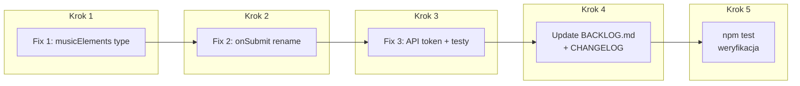

# Plan implementacji — 3 poprawki z BACKLOG biblioteki

---

## Fix 1: Rozszerzenie `ToolboxSearchQuery.musicElements` na `string | number[]`

### Pliki do zmiany
| Plik | Zmiana |
|------|--------|
| [`musicElements.ts`](projects/guitar-toolbox-lib/src/lib/shared/model/musicElements.ts:2) | `musicElements: string` → `musicElements: string \| number[]` |
| [`toolbox-form.component.ts`](projects/guitar-toolbox-lib/src/lib/toolbox-form/toolbox-form.component.ts:57) | Bez zmian — emituje `string` (zgodne z rozszerzonym typem) |
| [`custom-pattern.component.ts`](projects/guitar-toolbox-lib/src/lib/custom-pattern/custom-pattern.component.ts:35) | Bez zmian — emituje `number[]` (typ będzie zgodny po zmianie) |

### Skutki uboczne
- [`toolbox-form.component.spec.ts:56-60`](projects/guitar-toolbox-lib/src/lib/toolbox-form/toolbox-form.component.spec.ts:56-60) — oczekuje `musicElements: 'Single note'` (string) → OK, bez zmian
- [`api.service.ts:13`](projects/guitar-toolbox-lib/src/lib/api.service.ts:13) — metoda `sendToolboxRequest` przyjmuje `{ musicElements: string }` → **trzeba rozszerzyć typ parametru na `string | number[]`** i dodać konwersję przed budowaniem URL

### Kod do zmiany

**`musicElements.ts`:**
```typescript
export interface ToolboxSearchQuery {
  musicElements: string | number[];  // ← zmiana
  keys: string;
  type: QueryTypes;
}
```

**`api.service.ts` — dostosowanie typu parametru:**
```typescript
sendToolboxRequest(query: { type: string, musicElements: string | number[], keys: string }) {
  const elements = Array.isArray(query.musicElements)
    ? query.musicElements.join(',')
    : query.musicElements;
  const url = `${this.apiUrl}/${query.type}s/${elements}/${query.keys}`;
  // ...
}
```

---

## Fix 2: Zmiana nazwy `onSubmit$` → `onSubmit`

### Pliki do zmiany
| Plik | Zmiana |
|------|--------|
| [`toolbox-form.component.ts:17`](projects/guitar-toolbox-lib/src/lib/toolbox-form/toolbox-form.component.ts:17) | `@Output() onSubmit$` → `@Output() onSubmit` |
| [`toolbox-form.component.ts:62`](projects/guitar-toolbox-lib/src/lib/toolbox-form/toolbox-form.component.ts:62) | `this.onSubmit$.emit(query)` → `this.onSubmit.emit(query)` |
| [`toolbox-form.component.spec.ts:44`](projects/guitar-toolbox-lib/src/lib/toolbox-form/toolbox-form.component.spec.ts:44) | `spyOn(component.onSubmit$, 'emit')` → `spyOn(component.onSubmit, 'emit')` |
| [`toolbox-form.component.spec.ts:56`](projects/guitar-toolbox-lib/src/lib/toolbox-form/toolbox-form.component.spec.ts:56) | `expect(component.onSubmit$.emit)` → `expect(component.onSubmit.emit)` |
| [`app.component.html`](projects/guitar-toolbox-lib/src/lib/app.component.html:1) | `(onSubmit$)="toolboxSubmit($event)"` → `(onSubmit)="toolboxSubmit($event)"` |

### Uwaga
To jest **breaking change** dla konsumenta biblioteki (host app). Host app w `Guitar neck UI` będzie musiał zmienić `(onSubmit$)` → `(onSubmit)` w swoim szablonie. Należy to udokumentować w CHANGELOG.

---

## Fix 3: Konfigurowalny URL API przez InjectionToken

### Pliki do zmiany
| Plik | Zmiana |
|------|--------|
| **Nowy plik:** `projects/guitar-toolbox-lib/src/lib/api-config.token.ts` | Utworzenie `InjectionToken<string>` z domyślną wartością |
| [`api.service.ts`](projects/guitar-toolbox-lib/src/lib/api.service.ts) | Wstrzyknięcie tokena zamiast hardcodowanego `apiUrl` |
| [`api.service.spec.ts`](projects/guitar-toolbox-lib/src/lib/api.service.spec.ts) | Test z domyślną wartością + test z nadpisaną wartością |
| [`public-api.ts`](projects/guitar-toolbox-lib/src/public-api.ts) | Eksport `API_BASE_URL` |

### Nowy plik: `api-config.token.ts`

```typescript
import { InjectionToken } from '@angular/core';

export const API_BASE_URL = new InjectionToken<string>('API_BASE_URL', {
  providedIn: 'root',
  factory: () => 'http://localhost:3000/api'
});
```

### Zmiany w `api.service.ts`

```typescript
import { Injectable, Inject, Optional } from '@angular/core';
import { HttpClient, HttpErrorResponse } from '@angular/common/http';
import { catchError, throwError } from 'rxjs';
import { API_BASE_URL } from './api-config.token';

@Injectable({
  providedIn: 'root'
})
export class ApiService {
  constructor(
    private http: HttpClient,
    @Inject(API_BASE_URL) private apiUrl: string
  ) { }

  // reszta bez zmian
}
```

### Zmiany w `api.service.spec.ts`

```typescript
import { API_BASE_URL } from './api-config.token';

// Test 1: domyślna wartość
beforeEach(() => {
  TestBed.configureTestingModule({
    imports: [HttpClientTestingModule]
    // brak providera — używa domyślnej wartości z InjectionToken
  });
  // ...
});

it('should send a GET request to custom URL when API_BASE_URL is overridden', () => {
  TestBed.resetTestingModule();
  TestBed.configureTestingModule({
    imports: [HttpClientTestingModule],
    providers: [
      { provide: API_BASE_URL, useValue: 'https://api.production.com/api' }
    ]
  });
  // ...
  const req = httpTestingController.expectOne('https://api.production.com/api/scales/Major/C');
});
```

---

## Dodatkowo: Update BACKLOG.md

| Item | Obecny status | Nowy status |
|------|--------------|-------------|
| BEM markup + CSS Custom Properties | OPEN | **FIXED** ✅ (już zamigrowane) |
| ToolboxSearchQuery.musicElements | OPEN | **FIXED** (po Fix 1) |
| onSubmit$ → onSubmit | OPEN | **FIXED** (po Fix 2) |
| Configurable API URL | OPEN | **FIXED** (po Fix 3) |

---

## Kolejność implementacji



### Szacowany nakład

| Krok | Zadanie | Szac. czas |
|------|---------|-----------|
| 1 | Fix 1 — zmiana typu + api.service.ts | ~5 min |
| 2 | Fix 2 — rename onSubmit$ → onSubmit | ~5 min |
| 3 | Fix 3 — InjectionToken + testy | ~15 min |
| 4 | BACKLOG.md + CHANGELOG | ~5 min |
| 5 | `npm test` — weryfikacja | ~2 min |

---

## Pytanie do decyzji

Czy przy Fix 2 (`onSubmit$` → `onSubmit`) mamy również zaktualizować host app w `Guitar neck UI` (zmiana w szablonie z `(onSubmit$)` na `(onSubmit)`), czy tylko bibliotekę i udokumentować to jako breaking change?
